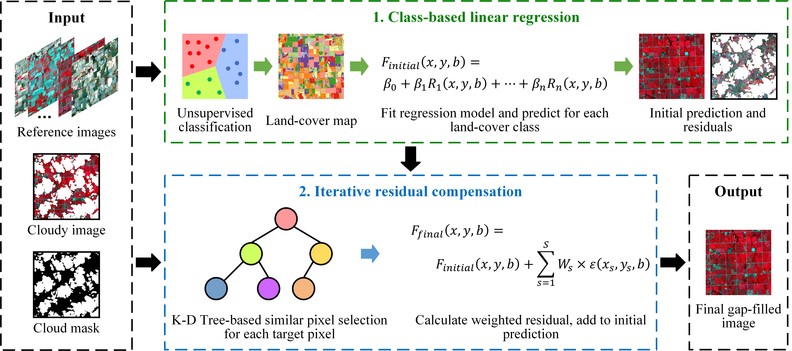
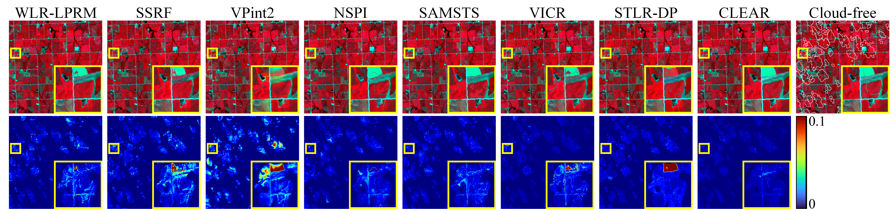

# CLEAR-code
This is the Python implementation of our paper "CLEAR: A Fast Cloud Removal Method for Optical Remote Sensing Images Combining Class-based Linear Regression and Iterative Residual Compensation"

CLEAR is a **simple, accurate, and efficient** remote sensing image gap-filling method that utilizes cloud-free or low-cloud-cover images from the time series to fill the missing values (e.g., clouds and cloud shadows) in the target image. CLEAR does not require training and is highly flexible, allowing for fast implementation in your own applications.

## Example
### Comparison with SOTA methods
The figure below shows the comparison results of CLEAR and other methods on a simulated cloudy image in an agricutural area. One can observe from the figure that the image processed by CLEAR has the highest similarity to the real image and exhibits the lowest error.

### Reconstructing NDVI Time-series for Agricultural Studies 
The figure below shows an example of applying CLEAR in an agricultural area to reconstruct the NDVI time-series. One can observe that the NDVI maps exhibit clear spatial details and growing trends of the crops, and the NDVI values reconstructed by CLEAR align closely with those of cloud-free Sentinel-2 images. Moreover, the fitted NDVI curves reveal distinct temporal patterns for the two crops.

### Continuous Gap-filling of Sentinel-2 Tiles
The figure below shows an example of applying CLEAR to fill gaps in Sentinel-2 tile T15TFF from April to October, 2022. One can observe from the figure that the spatial details of the land surface and crop phenology are clearly presented in the gap-filled images. The gap-filling process consumed approximately 3660 minutes on a single CPU.

For more information, please refer to our paper.

## Data
Data used in our paper: [https://drive.google.com/drive/folders/1e5gDRZQacl8i6lITvRRUugTwQ1OwF60Y?usp=drive_link](https://drive.google.com/drive/folders/1hVNsoRjoYoR4ppALSXwDZrW2LAl3BIVg?usp=drive_link)  
The images are with uint16 data type and a value range of 0-10000. Dividing by 10000 yields the surface reflectance.

## Known issue 
When cloud and cloud shadow detection is inaccurate (i.e., there are omission errors in the cloud mask), the images processed by CLEAR may contain brighter or darker pixels. This is a common problem shared by most cloud removal algorithms. Applying time-series smoothing or filtering in post-processing may help address this issue.

## Contact
**If you have any questions about our code or need my help in implementing CLEAR for your own research, please feel free to contact me via email.**  
Author: Houcai GUO, PhD student at the University of Trento, Italy  
E-mail: houcai.guo@unitn.it; guohoucai@qq.com
